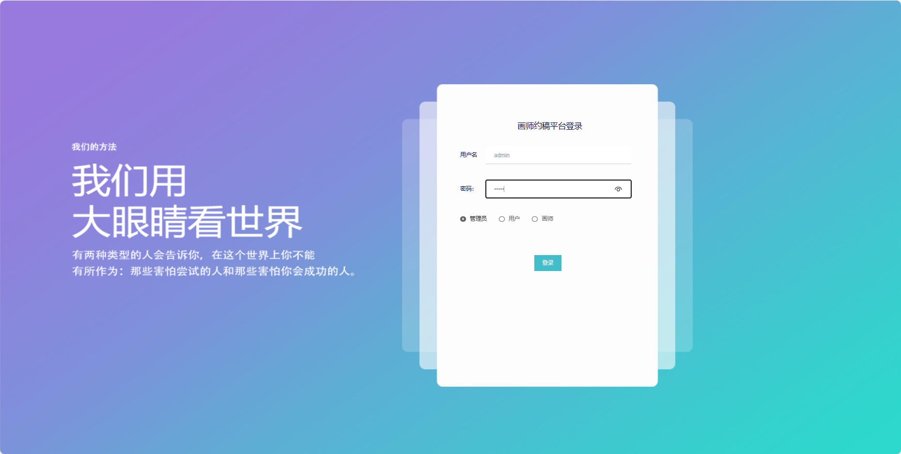

## 基于SpringBoot的画师约稿平台

- <b>完整代码获取地址：从戎源码网 ([https://armycodes.com/](https://armycodes.com/))</b>
- <b>技术探讨、资料分享，请加QQ群：692619798</b> 
- <b>作者微信：19941326836  QQ：952045282</b> 
- <b>承接计算机毕业设计、Java毕业设计、Python毕业设计、深度学习、机器学习</b>
- <b>选题+开题报告+任务书+程序定制+安装调试+论文+答辩ppt 一条龙服务</b>
- <b>所有选题地址 ([https://github.com/YuLin-Coder/AllProjectCatalog](https://github.com/YuLin-Coder/AllProjectCatalog)) </b>

## 项目介绍
基于SpringBoot的画师约稿平台，系统包含三种角色：管理员、用户，画师，主要功能如下。管理员【后台功能】系统首页

### 【管理员】:
1. 系统首页：提供管理员进入后台管理的入口。
2. 个人中心：管理员可以管理个人信息。
3. 作品类型管理：维护系统中的作品类型信息。
4. 用户管理：查看、编辑、冻结或删除用户账号。
5. 画师管理：管理画师信息。
6. 画师作品管理：查看、编辑、删除画师上传的作品信息。
7. 约稿信息管理：记录用户对画师的约稿需求。
8. 稿件作品管理：管理用户提交的稿件作品。
9. 系统管理：包括系统的基本设置。

### 【用户】:
1. 系统首页：提供用户进入后台管理的入口。
2. 个人中心：用户可以管理个人信息。
3. 约稿信息管理：用户可以查看自己发布的约稿信息。

### 【画师】:
1. 系统首页：提供画师进入后台管理的入口。
2. 个人中心：画师可以管理个人信息等。
3. 画师作品管理：查看、编辑、删除自己上传的作品信息。
4. 约稿信息管理：画师可以查看约稿信息。
5. 稿件作品管理：画师可以管理自己提交的稿件作品。

## 项目技术
- 编程语言：Java
- 数据库：MySQL
- 项目管理工具：Maven
- 前端技术：HTML、CSS、JavaScript、Jquery、Vue
- 后端技术：Spring、SpringMVC、MyBatis

## 运行环境
- JDK版本：JDK1.8及以上
- 开发工具：IDEA、Ecplise、Myecplise都可以
- 数据库: MySQL5.7及以上
- Maven：maven3.0及以上
- Node：14.14.0及以上

## 运行截图

